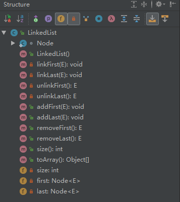

## LinkedList

学习LinkedList主要是想学习如何基于链表去实现一个数据容器。在阅读过源码后，通过参考LinkedList的实现，自己实现了一个简陋版本的LinkedList

### 内部类

```java
static class Node<E>{
    E item;
    Node<E> next;
    Node<E> prev;
    Node(E e,Node<E> p,Node<E> n){
        item = e;
        next = n;
        prev = p;
    }
}
```

在LinkedList的内容有一个Node<E>的内部类，定义了每一个节点存储的数据、前一个节点的引用以及后一个节点数据的应用

### 属性 

```java
private int size;
private Node<E> first;
private Node<E> last;
```

在LinkedList的内部有三个总要的属性：`size`、`first`和`last`.三个属性记录的当前容器数据数量、头元素和最后一位元素

### 方法



LinkedList内部主要有`linkxxx`、`unlinkxxx`、`addxxx`和`removexxx`方法，其中`addxxx`和`removexxx`方法都是基于`linkxxx`和`unlinkxxx`方法实现。

```java
    public void addFirst(E e){
        linkFirst(e);
    }

    public void addLast(E e){
        linkLast(e);
    }

    public E removeFirst(){
        return unlinkFirst();
    }

    public E removeLast(){
        return unlinkLast();
    }
```
### 添加元素
```java
private void linkFirst(E e){
    final Node<E> f = first;
    final Node<E> newNode = new Node<E>(e,null,f);//新元素放在First之前
    first = newNode;//将全局First更新为最新的节点数据
    if(f == null){//如果是刚初始化，这First为null,last=First
        last = newNode;
    }else//如果添加之前First不为null，添加之前的First的prev指向新的First
        f.prev = newNode;
    size ++;//元素内容
}
```

### 删除元素

```java
private E unlinkFirst(){//这里就不判断刚初始化容器 情况下调用
        if(first == null) return null;
        final Node<E> f = first;//拿到头元素
        final Node<E> n = first.next;//拿到头元素的下一个元素
        first = n;//将第二个元素设置为头元素
        final E e = f.item;//拿到头元素的内容，用final设置是因为后面置空f.item时，不影响到需要返回的内容
        f.item = null;//置空内容
        f.next = null;//置空next
        if(n == null){//删除到最后一位了
            last = null;
        }else{//置空prev
            n.prev = null;
        }
        size --;
        return e;
    }
```